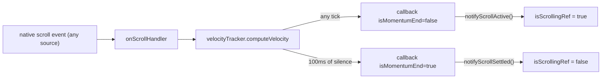

# `isScrolling()` — source-agnostic scroll-state flag

## 1. What this is

`isScrolling()` is a source-agnostic boolean getter exposed by `useRecyclerViewController`: `true` while the FlashList scroll viewport is in motion (regardless of who started the scroll), `false` after 100 ms of scroll-event silence.

It is threaded as a prop into [`ViewHolderCollection`](src/recyclerview/ViewHolderCollection.tsx) so future work on the sort-defer machinery (`maybeDoSort` / `schedulePendingSort`) can gate on "is the viewport actually moving right now?" without conflating with the programmatic-scroll-only `isScrollingProgrammatically()`.

The flag is backed by a single `isScrollingRef` and toggled by two single-purpose methods invoked from `RecyclerView`'s scroll handler:

- `notifyScrollActive()` — sets it to `true`.
- `notifyScrollSettled()` — sets it to `false`.

## 2. Why it exists — the gap in existing scroll-state signals

| Signal | Where | What it means | Why it doesn't fit "is anything scrolling?" |
| --- | --- | --- | --- |
| `isProgrammaticScrollActiveRef` | [useRecyclerViewController.tsx:61](src/recyclerview/hooks/useRecyclerViewController.tsx) | Set on `scrollToIndex` / `scrollToOffset` entry, cleared by `notifyProgrammaticScrollSettled` on momentum-end. | Programmatic-only. Misses user-driven scrolls. |
| `isProgrammaticScrollQueuedRef` | [useRecyclerViewController.tsx:69](src/recyclerview/hooks/useRecyclerViewController.tsx) | Set by the public `queueProgrammaticScroll()` API. Pre-scroll intent. | Programmatic-only. |
| `isScrollingProgrammatically()` | [useRecyclerViewController.tsx:244-249](src/recyclerview/hooks/useRecyclerViewController.tsx) | OR of the above two. | Misses user-driven scrolls. |
| `pauseOffsetCorrection` | [useRecyclerViewController.tsx:53](src/recyclerview/hooks/useRecyclerViewController.tsx) | Pauses MVCP offset corrections during chunked `scrollToIndex` steps. | Flickers under chunked scrolls; cleared by fixed 100 / 200 / 300 ms timers, not by the actual scroll-completion signal. Not usable. |
| `ignoreScrollEvents` | [RecyclerViewManager.ts:40](src/recyclerview/RecyclerViewManager.ts) | Internal 100 ms blackout for MVCP synthetic scrolls. | Internal-only; narrow; doesn't answer the general question. |

None of these answer the question **"is any scroll, from any source, in progress right now?"**. `isScrolling()` does.

## 3. Mechanism

Every native `scroll` event — touch drag, mousewheel, keyboard, programmatic smooth scroll, anchor `scrollBy`, etc. — feeds [`VelocityTracker.computeVelocity`](src/recyclerview/helpers/VelocityTracker.ts) inside `onScrollHandler`. The `VelocityTracker` already debounces a 100 ms "silence" timeout and fires its callback with `isMomentumEnd: true` when no further scroll events have arrived for that long. That timeout is the natural source-agnostic settle signal — we just hang the new flag off it.

## 4. Why two purpose-built methods, not folded into `notifyProgrammaticScrollSettled`

The existing `notifyProgrammaticScrollSettled` ([useRecyclerViewController.tsx:270](src/recyclerview/hooks/useRecyclerViewController.tsx)) does three things tied to programmatic scrolls:

1. Clears `isProgrammaticScrollActiveRef`.
2. Clears `isProgrammaticScrollQueuedRef`.
3. Drains the pending callback registered via `runAfterProgrammaticScroll`.

The new `isScrollingRef` is a different, source-agnostic concern. Folding it in would tangle two responsibilities behind one method name and change what "programmatic-settled" semantically means.

Two single-purpose siblings (`notifyScrollActive` / `notifyScrollSettled`) keep responsibilities clean, avoid renaming any existing API, and match the "one method, one mutation" style of the rest of the controller.

## 5. False-positive analysis

`computeVelocity` is called from a single site, [RecyclerView.tsx:284](src/recyclerview/RecyclerView.tsx) inside `onScrollHandler`, which is wired as `<CompatScrollView>`'s `onScroll`. Every callback firing corresponds to a real RN-level scroll event.

Walking through every code path that produces those events:

- **User touch drag / mousewheel / scrollbar drag / arrow-key scroll** → flag flips `true` while events arrive, `false` 100 ms after the last one. Correct.
- **`scrollViewRef.scrollTo({...})` (programmatic)** → flag tracks the smooth-scroll animation. Correct.
- **`scrollAnchorRef.scrollBy(diff)` anchor offset correction** ([useRecyclerViewController.tsx:205](src/recyclerview/hooks/useRecyclerViewController.tsx)) → flag flips `true` briefly. The viewport actually moves, so this is the correct semantic for any future sort-defer use.
- **MVCP `scrollTo` correction in the data-changed branch** ([useRecyclerViewController.tsx:218-227](src/recyclerview/hooks/useRecyclerViewController.tsx)) → suppressed by the 100 ms `ignoreScrollEvents` blackout. Both early returns ([RecyclerView.tsx:267](src/recyclerview/RecyclerView.tsx) and [RecyclerView.tsx:289](src/recyclerview/RecyclerView.tsx)) protect the flag. Stays `false`. Correct — these are explicitly invisible-by-design.
- **Initial-mount layout settling** → may fire one scroll event with offset 0; flag flips briefly, self-clears in 100 ms. Benign.
- **Hypothetical zero-delta scroll events** (browsers normally don't dispatch these) → if they did, flag flips briefly; self-clears. Benign.

**Conclusion**: the flag's literal semantic is "a native scroll event has fired in the last 100 ms", which is a strict superset of what we care about. No meaningful false positives.

## 6. Known false negatives

These exist by design and are documented so consumers know when to compose with other signals.

- **Pre-scroll gap**: between `scrollToIndex()` API call and the first scroll event arriving (~16 ms on web), `isScrolling()` returns `false`. Pre-scroll gating still uses `isScrollingProgrammatically()` (which covers `queueProgrammaticScroll` + active programmatic). The two compose.
- **MVCP blackout**: during the ≤100 ms after a data-changed correction, if a user-initiated scroll started inside the blackout, its events are dropped. After the blackout clears, subsequent events flip the flag true. Brief and rare.

## 7. Composition with existing flags

| Question | Use this |
| --- | --- |
| "Is a programmatic scroll queued or in flight?" | `isScrollingProgrammatically()` |
| "Is the viewport in motion (any source) right now?" | `isScrolling()` |
| "Is any scroll either pre-imminent or in motion?" | `isScrollingProgrammatically() \|\| isScrolling()` |

## 8. Why this is sound for sort-gating — latency reasoning

A natural question: if `isScrolling` only flips `true` after the first scroll event arrives, doesn't that leave a window where the user has started scrolling but the flag still reads `false`?

It does — but that window is exactly the window during which the list is **visually static**, so a sort committed inside it cannot introduce stale state.

- FlashList only repositions absolutely-positioned items in response to `scroll` events processed by `onScrollHandler`.
- Items haven't visually moved until at least one `scroll` event has been seen.
- A sort firing _before_ the first scroll event sees pre-scroll positions; just permutes DOM order; no staleness.
- A sort firing _after_ the first scroll event sees `isScrolling = true` (it's the same callback that processes the event), so a future sort gate would defer.

The `isScrolling` latency window and the "list is visually static" window are the same window. A future sort gate keyed on `isScrolling()` is therefore correct in both directions.

## 9. Exposure-only scope

The current change only **exposes** `isScrolling()` everywhere it needs to be available — controller getter, `useRecyclerViewController` return value, threaded as a prop into `ViewHolderCollection` and destructured there.

It does **not** wire the flag into `maybeDoSort` or `schedulePendingSort`. Broadening the sort-defer gate from `isScrollingProgrammatically()` to also include `isScrolling()` is a follow-up, deliberately separated so the wiring change can land independently.

## 10. See also

- [viewholder-marker-and-focus-filter.md](viewholder-marker-and-focus-filter.md) — the focus-filter layer that decides whether `onFocusIn` calls `maybeDoSortOnFocus` in the first place. Independent of `isScrolling()`, but consumed by the same machinery once the call is made.
- [web-scroll-freeze-fix.md](web-scroll-freeze-fix.md) — the original sort-deferral design that introduced `isScrollingProgrammatically()` and `runAfterProgrammaticScroll`.
