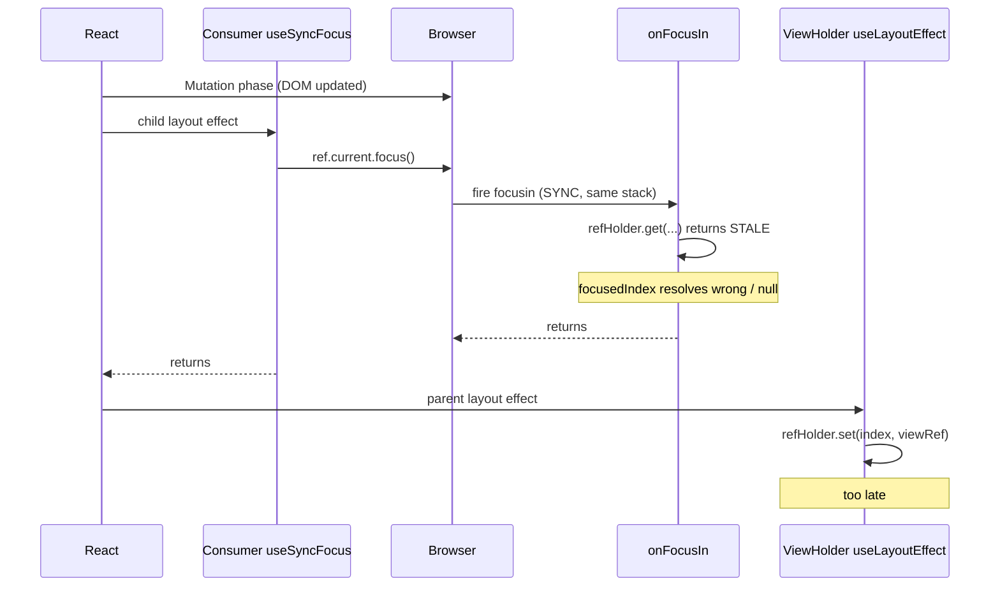
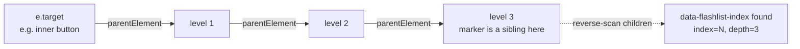

# ViewHolder marker + focus-filter mechanism

> **Status:** implemented. See §6 for the per-file changes with line citations to the live source.
>
> **Scope:** internal to `@shopify/flash-list`. No public API change. No new DOM listeners except the existing `focusin` listener (already present from patch-007). Web-only — gated by `Platform.OS === "web"` everywhere it matters.

---

## 0. TL;DR

[`ViewHolder`](src/recyclerview/ViewHolder.tsx) renders an invisible `<div data-flashlist-index={index}>` as a sibling of `{children}` and `{separator}`. The container's `focusin` listener in [`ViewHolderCollection`](src/recyclerview/ViewHolderCollection.tsx) walks up from `event.target` and reads that attribute to identify which logical row owns the focused element. Two filters then suppress non-real focus events: `isSameLogicalRow` (same row + same walk-up depth) and `isPhantomMutationFocus` (`relatedTarget === null` during React's mutation phase).

This replaces an earlier `refHolder`-based lookup that lost a race during recycling: `refHolder.set(index, ref)` runs in ViewHolder's `useLayoutEffect` (a parent effect), but `useSyncFocus` calls `.focus()` from a child `useLayoutEffect`. Child effects run before parent effects, so `focusin` fired while the map still held a stale `index → ref` mapping — and the lookup either returned the wrong index or `null`.

The marker lands during commit's mutation phase, **before any** `useLayoutEffect` runs. By the time `focusin` fires, the attribute is already on the new DOM. Lookup is fully synchronous and timing-independent.

---

## 1. Why this exists — the H_A race

### 1.1 Setup

Patch-007 maintains DOM order for Tab/screen-reader correctness by sorting `renderEntriesRef` and emitting `insertBefore` on commits that change the order. To decide whether a sort is "real focus driven" or just incidental noise, the container listens for `focusin` and identifies which logical row received focus.

The original implementation used a `Map<number, RefObject>` (`refHolder`) populated by each `ViewHolder`'s `useLayoutEffect`:

```typescript
useLayoutEffect(() => {
  refHolder.set(index, viewRef);
  return () => {
    if (refHolder.get(index) === viewRef) refHolder.delete(index);
  };
}, [index, refHolder]);
```

The `focusin` handler iterated the map and used `el.contains(target)` to find the owning row.

### 1.2 The race

React commits in two relevant phases:

1. **Mutation phase** — DOM attributes/insertions are applied (`flushMutationEffects`).
2. **Layout phase** — `useLayoutEffect`s run, child-first, then parents.

The consumer's `useSyncFocus` is a `useLayoutEffect` running on a leaf component **inside** `{children}`. ViewHolder's effect that writes `refHolder.set(index, ref)` is on an ancestor. By React's child-first rule, the consumer's effect fires first. When it calls `ref.current?.focus()`, `focusin` is dispatched **synchronously** (DOM spec — programmatic `.focus()` does not queue), so the listener runs *before* ViewHolder's `useLayoutEffect` has had a chance to update `refHolder` for this commit.

Result on a recycle commit:



The race produced two distinct symptoms in our repro logs (300+ events captured at runtime):

- **Phantom events** — React's `flushMutationEffects` re-focused a recycled DOM element that used to host the focused row but now hosts a different one. `focusin` fired with `relatedTarget === null`. Old refHolder lookup returned a stale (or absent) index.
- **Bounce-back events** — `useSyncFocus` then called `.focus()` on the new DOM home of the user's focused row. The previous phantom had already polluted `lastFocusedIndexRef` (via the wrong index), so the bounce-back failed `isSameLogicalRow` and triggered a sort cascade.

## 2. Why a DOM attribute is race-free

`data-flashlist-index={index}` is plain JSX. React applies it during the **mutation phase**, which finishes *before any* layout effect runs. From that moment on:

- The marker for every visible row reflects the row's current data index.
- Reading `dataset.flashlistIndex` from any descendant of a ViewHolder always yields the right index.
- Whether the `focusin` source is `useSyncFocus` (layout phase), `flushMutationEffects` (mutation phase, sync), real user Tab/click (async, after commit), or anything else — the attribute is already on the DOM.

There is no React-internals timing assumption baked in. The only requirement is that the attribute be in JSX on every visible ViewHolder.

## 3. Mechanism

### 3.1 The marker

In [src/recyclerview/ViewHolder.tsx](src/recyclerview/ViewHolder.tsx), inside `CompatContainer` between `{children}` and `{separator}`:

```tsx
{children}
{Platform.OS === "web" && (
  <div
    data-flashlist-index={index}
    aria-hidden
    style={INVISIBLE_MARKER_STYLE}
  />
)}
{separator}
```

with a module-scope constant:

```tsx
const INVISIBLE_MARKER_STYLE = { display: "none" } as const;
```

#### 3.1.1 Why a raw `<div>` (not `<View>` / `<CompatView>`)

- `View` on RN-Web goes through `forwardRef`, style normalization, accessibility-prop processing, and platform-event wiring before producing a DOM `div`. The marker is invisible, non-interactive, and never read by anyone but our handler — that's all overhead with no value.
- TypeScript natively accepts `data-*` props on intrinsic HTML elements; `<View>` does not. Using `<div>` removes the spread-with-cast workaround.
- The element is only rendered on web (`Platform.OS === "web" && ...`). On native, the right side of `&&` is never evaluated, so `React.createElement('div')` is never called there.

#### 3.1.2 Why `display: none` only

`display: none` is the simplest, strongest "hide" available: removed from layout, not rendered, no events, no focus, excluded from the accessibility tree by default. The earlier draft listed `position: absolute; width: 0; height: 0; opacity: 0; pointerEvents: none` — every property in that set is redundant when `display: none` is used. `aria-hidden` is technically also redundant but is kept as in-source documentation that the element is intentionally invisible.

### 3.2 Walk-up resolver

In [src/recyclerview/ViewHolderCollection.tsx](src/recyclerview/ViewHolderCollection.tsx), `findFocusedIndexFromMarker(target, root)` walks up from `e.target` and, at each ancestor, scans that ancestor's direct children **from last to first** for an element carrying `data-flashlist-index`. The marker is placed between `{children}` and `{separator}`, so it lives near the end of the direct-children list — reverse iteration finds it in 1–2 checks. The walk stops at `containerRef.current` (the ViewHolderCollection's root), so a `focusin` from outside the list resolves to `null`.

The function returns both `index` and `depth` (number of `parentElement` hops taken before the marker was found among the parent's direct children). The depth lets the caller distinguish "same row, same focused slot" (recycle re-focus) from "same row, different focused element" (e.g. Tab from outer Pressable into a deeper child of the row).



## 4. Filter design

The `focusin` listener computes two booleans and early-returns if either is true.

### 4.1 `isSameLogicalRow`

```typescript
const isSameLogicalRow =
  focusedIndex !== null &&
  focusedIndex === lastFocusedIndexRef.current &&
  focusedDepth === lastFocusedDepthRef.current;
```

Catches:

- `useSyncFocus` recycle-rebinds: same logical row, just re-bound to a new DOM node at the same depth in the row's tree.
- React's `restoreSelection` re-focusing the same row after sort mutations.

Lets through:

- Tab from the outer Pressable into a deeper child of the same row (same index, **different** depth) — these are real focus changes.
- Any focus change to a different row (different index).

### 4.2 `isPhantomMutationFocus`

```typescript
const isPhantomMutationFocus =
  e.relatedTarget === null && focusedIndex !== null;
```

`flushMutationEffects` can fire `focusin` on a recycled DOM element that was previously focused but now hosts different content. These have `relatedTarget === null` — there is no clean preceding blur because the "old" element either changed under the focus or was repurposed in the same commit. Real focus changes — arrow-key nav, click, Tab — always carry a relatedTarget.

Filtering null-related in-list focusins keeps `lastFocusedIndexRef` from being polluted with the recycled row's index. The bounce-back focus fired by `useSyncFocus` later in the same commit is then correctly caught by `isSameLogicalRow`.

### 4.3 Edge case acknowledged

Two focusable children at the **same DOM depth** inside the same row (e.g. two side-by-side buttons reachable by Tab) would both have the same `(index, depth)` and Tab between them would be filtered. This is intentional: the first outer→inner jump already triggered a sort to align DOM order, and subsequent sibling jumps within the same row don't require a new sort.

## 5. What this replaced — the simplification

After the marker + new filters were in place, runtime logging across multiple ~300-event reproductions showed `lastFocusTargetRef` and the `isSameDomTarget` check did **zero unique work**. Every event the DOM-identity check caught was already caught by either `isSameLogicalRow` or `isPhantomMutationFocus`:

| Counterfactual | Newly leaked events |
| --- | --- |
| Remove `isSameDomTarget` | 0 |
| Remove `isSameLogicalRow` | 115 |
| Remove `isPhantomMutationFocus` | 4 |
| `focusedIndex === null` events | 0 |

`focusedIndex === null` never occurred — the marker walk-up never failed across the entire trace, ruling out any need for a DOM-identity fallback. So we removed:

- `const lastFocusTargetRef = useRef<EventTarget | null>(null);`
- `const isSameDomTarget = e.target === lastFocusTargetRef.current;`
- `const isSelfRefocus = isSameDomTarget || isSameLogicalRow;`
- `lastFocusTargetRef.current = e.target;` write in the success path
- The original "Self-refocus filter" comment block

Kept:

- `lastFocusedIndexRef` and `isSameLogicalRow` — the workhorse (catches >99% of filtered events).
- `lastFocusedDepthRef` — added later to distinguish Tab-into-child within the same row.
- `isPhantomMutationFocus` — small but non-zero contribution; the only filter that catches mutation-phase phantoms cleanly.

## 6. Per-file changes (line citations)

[src/recyclerview/ViewHolder.tsx](src/recyclerview/ViewHolder.tsx)

- Module constant `INVISIBLE_MARKER_STYLE = { display: "none" } as const;` near the imports.
- `Platform` added to the `react-native` import.
- The `<div data-flashlist-index={index} aria-hidden style={INVISIBLE_MARKER_STYLE} />` JSX sibling, gated by `Platform.OS === "web"`, between `{children}` and `{separator}` inside `CompatContainer`.

[src/recyclerview/ViewHolderCollection.tsx](src/recyclerview/ViewHolderCollection.tsx)

- `findFocusedIndexFromMarker(target, root): { index: number; depth: number } | null` at module scope above the component.
- `lastFocusedDepthRef` added next to `lastFocusedIndexRef`.
- `onFocusIn` resolves the focused row via `findFocusedIndexFromMarker`, derives `focusedIndex` and `focusedDepth`, and computes the two filter booleans.
- The early-return `if (isSameLogicalRow || isPhantomMutationFocus) return;`.
- Success path writes both `lastFocusedIndexRef.current = focusedIndex;` and `lastFocusedDepthRef.current = focusedDepth;`.

## 7. Native compatibility

- `Platform.OS === "web"` gates the marker JSX in `ViewHolder`, so on native the `&&` short-circuits and `React.createElement('div')` is never called.
- The `focusin` listener and `findFocusedIndexFromMarker` are gated by the same `Platform.OS !== "web"` early-return in `ViewHolderCollection`'s `useEffect` that registers the listener. On native nothing in this mechanism runs.

## 8. Composition with existing scroll/sort machinery

This mechanism only changes how `onFocusIn` decides whether to call `maybeDoSortOnFocus`. Once that call is made, the existing scroll-aware sort scheduling (`isScrollingProgrammatically`, `isScrolling`, `runAfterProgrammaticScroll`, `schedulePendingSort`, `useDeferredCallback`, the focus-induced-scroll heuristic) is unchanged. Refer to the prior `web-scroll-freeze-fix.md` and `is-scrolling-flag.md` documents for that layer.
